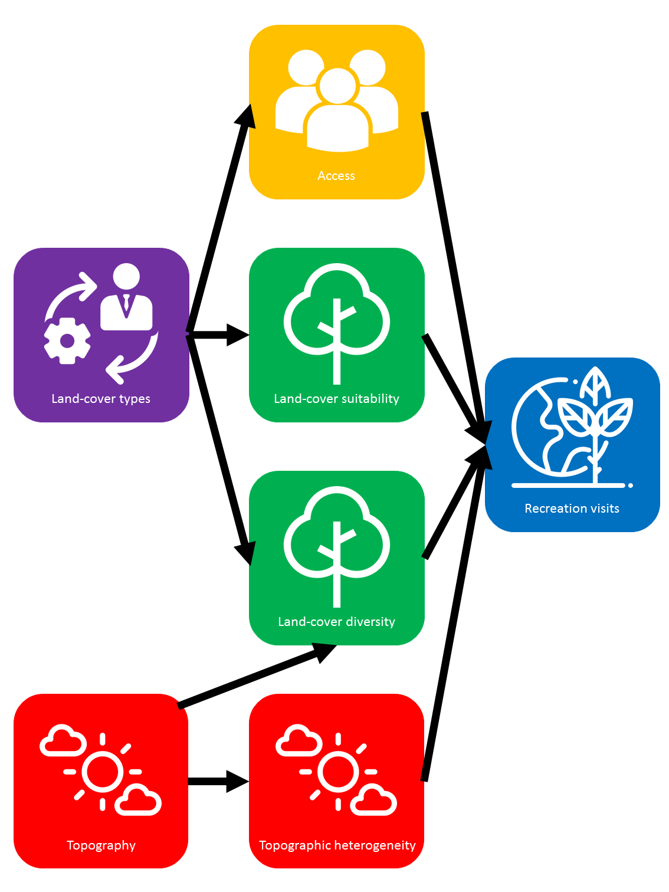

```{r setup, include=FALSE}
knitr::opts_chunk$set(echo = FALSE, warning = FALSE, message = FALSE)

# load required packages
library(jtools)
library(MASS)
library(raster)
library(rgdal)
library(rgeos)
library(tidyverse)
library(cowplot)
library(ggmap)
library(GGally)
library(DHARMa)
library(landscapetools)
library(patchwork)
library(broom)
library(knitr)
library(grainchanger) 
# needs installing via devtools::install_github("laurajanegraham/grainchanger")


# set ggplot options
theme_set(theme_classic() + theme(strip.background = element_blank()))

# required coordinate strings
crs_bng <- "+proj=tmerc +lat_0=49 +lon_0=-2 +k=0.9996012717 +x_0=400000 +y_0=-100000 +ellps=airy +towgs84=446.448,-125.157,542.06,0.15,0.247,0.842,-20.489 +units=m +no_defs "

crs_wgs84 <- "+proj=longlat +datum=WGS84"

# study area bounding box
convert_coords <- function(deg, min, sec) {
  coord <- deg + min/60 + sec/60^2
}

xmin <- convert_coords(2, 19, 44)
xmax <- convert_coords(1, 30, 44)
ymin <- convert_coords(50, 58, 44)
ymax <- convert_coords(51, 25, 40)


# create a 5km grid for the analysis (NB this makes the overall area slightly larger than
# originally specified - need to check against the points from Lucy when I have them as to
# how much of an issue this might be)
es_ras <- raster(extent(-xmin, -xmax, ymin, ymax), crs = crs_wgs84) %>% 
  projectExtent(crs = crs_bng)

es_grid <- as(es_ras, 'SpatialPolygonsDataFrame')

# 5km resolution
res(es_ras) <- 5000

# create polygrid
es_grid <- as(es_ras, 'SpatialPolygonsDataFrame')

# now we need a couple of buffered versions of the study area for cropping and snapping
# 10km buffer for extracting data to allow for moving window to avoid edge effects
study_bbox_10km <- gBuffer(es_grid, width = 10000, capStyle = "SQUARE", 
                           joinStyle = "MITRE", mitreLimit = 10000/2)

# 10km buffered raster at 25m resolution to snap data to
ras_10km <- raster(extent(study_bbox_10km), crs = crs(es_grid))
res(ras_10km) <- c(25, 25)

# this one for intermediary cropping of dem before transforming crs
study_bbox_20km <- gBuffer(es_grid, width = 20000, capStyle = "SQUARE", 
                           joinStyle = "MITRE", mitreLimit = 20000/2)
```

# Introduction / Aim

Primary question: *How does land-use affect the provision of multiple ecosystem services?*

We will use our multiscale framework (as outlined in the upscaling paper, and built upon in this paper to extent to social-ecological systems) to understand: 

1. What level of detail (mechanism) is required to predict ES tradeoffs in the Wessex BESS landscape; and
2. The degree to which getting the scale of the various processes right matters
3. Whether fewer components at the right scale is as effective as (or more effective than) a more complex model at a unified scale

Our hypothesis for this paper is that by explicitly incorporating spatial structure into a system model, we can a) accurately predict spatial trade-offs in outcomes with b) relatively little information in c) a semi-mechanistic fashion.  

# Methods & Results

## Model design

Developed during CEH meeting (2018-03-27) - key factors include access, suitability for recreation, quality for recreation. [NOTE: I have moved it along from this a bit and I think that the overall design of the system model might need changing. Need to think on it. It's more about which things interact at fine scales, and which at broad scales]

```{r show_design}

```

## Data

### Recreation

We have point locations for recreation from the PPGIS study [@Ridding2018], we are going to aggregate these to get intensity within 5km resolution for the study site. 

```{r calc_rec}
rec_pts <- readOGR("data", "All_PPGIS_points_LR", verbose = FALSE)

rec_ras <- rasterize(rec_pts, es_ras, 'LUCY_FID', fun=function(x,...)length(x))

util_plot(rec_ras, legend_title = "Recreation intensity") + 
  theme(axis.text = element_blank(), 
        axis.title = element_blank())
```

### Environment

LCM 2015 [@Rowland2017] data were downloaded from Edina Digimap.EU-DEM data were downloaded from [European Environment Agency](https://www.eea.europa.eu/data-and-maps/data/copernicus-land-monitoring-service-eu-dem).

```{r load_env, eval = FALSE}
# Land cover map
lcm <- raster("~/DATA/LULC/lcm2015/lcm2015gb25m.tif")
lcm_site <- resample(lcm_site, ras_10km, method = "ngb")
plot(lcm_site)
writeRaster(lcm_site, "data/lcm_site.tif", overwrite = TRUE)

# DEM 
dem <- raster("~/DATA/PHYSICAL/elev/eu_dem_1.1/eudem_dem_3035_europe.tif")
study_bbox_dem <- spTransform(study_bbox_20km, crs(dem))
dem_site <- crop(dem, study_bbox_dem)
# all data going to be transformed to same as the LCM data. 
dem_site <- projectRaster(dem_site, crs = crs(lcm))
dem_site <- crop(dem_site, lcm_site)
dem_site <- resample(dem_site, lcm_site)
crs(dem_site) <- crs(lcm)
plot(dem_site) 
storage.mode(dem_site[]) = "integer" # reduces file size by 2/3, decimals not really needed
writeRaster(dem_site, "data/dem_site.tif", overwrite = TRUE)
```

Study area showing the spatial variation in environment variables (topography as hillshade, and land cover classes).

```{r plot_site}
dem_site <- raster("data/dem_site.tif")
slope <- terrain(dem_site, opt = "slope")
aspect <- terrain(dem_site, opt = "aspect")
hill <- hillShade(slope, aspect)

lcm_site <- raster("data/lcm_site.tif") 

lcm_lookup <- read_csv("~/DATA/LULC/lcm2015/lcm_lookup.csv")

dat <- stack(lcm_site, hill)

dat_df <- as.data.frame(dat, xy = TRUE) %>% na.omit %>% filter(lcm_site != 0) %>% 
  inner_join(lcm_lookup, by = c("lcm_site" = "lcm_id")) %>% 
  mutate(lcm_class = factor(lcm_class, levels = lcm_lookup$lcm_class),
         plot_col = rgb(red = red, green = green, blue = blue, maxColorValue = 255)) %>% 
  select(x, y, hillshade = layer, lcm_site, lcm_class, plot_col)

plot_cols <- group_by(dat_df, lcm_class) %>% summarise(plot_col = unique(plot_col)) %>% pull(plot_col)

ggplot(dat_df, aes(x = x, y = y)) + 
  geom_raster(aes(fill = lcm_class, alpha = hillshade)) + 
  scale_fill_manual(values = plot_cols, name = "Land cover class") + 
  scale_alpha(guide = "none") + 
  labs(x = "", y = "") +
  coord_equal()
```

### Applying data-aggregation method to create predictor variables

We first assume that at the fine scale, a cell needs to consist of a natural, non-water land cover class to be suitable for recreation. 

```{r calc_suitable, cache = TRUE}
check_suitable <- function(x) {
  ifelse(x %in% c(0, 13, 14, 20, 21), 0, 1)
}

lc_suitable <- raster::calc(lcm_site, fun = check_suitable)
lc_suitable <- crop(lc_suitable, es_grid)
save(lc_suitable, file = "results/lc_suitable.Rda")
```

```{r plot_suitable}
load("results/lc_suitable.Rda")
util_plot(lc_suitable, 
          discrete = TRUE, 
          legend_title = "Suitable land cover") + 
  theme(axis.text = element_blank(), 
        axis.title = element_blank())
```

Each predictor variable is built up from the suitable landcover variable and any other required data in the following way:

1. Use the moving window method to calculate the measure of interest for the variable at the appropriate scale. 
2. Multiply the resulting surface by the suitable land cover surface such that only cells which contain suitable land cover for recreation are included when aggregating to the coarse scale.
3. Calculate the mean value at the coarse (5km) scale. 

We use this method to calculate 3 predictors of recreation value for a 5km x 5km grid cell: access, land-cover diversity and topographic variation. 

**Access**: amount of urban/suburban land cover and a 2km radius window.

<!---Time taken to calculate the access variable using `winmove` from `grainchanger`:--->

```{r calc_access, cache = TRUE, eval = FALSE}
system.time(access <- winmove(lcm_site, 2000, "rectangle", "prop", lc_class = c(20, 21)))
access <- crop(access, es_grid)
save(access, file = "results/access.Rda")
```

```{r plot_access}
load("results/access.Rda")
a1 <- util_plot(access, legend_title = "Access (2km radius)\n25m cells") + 
  theme(axis.text = element_blank(), 
        axis.title = element_blank())

access_5km <- aggregate(access * lc_suitable, 200)
a2 <- util_plot(access_5km, legend_title = "Access (2km radius)\n5km cells") + 
  theme(axis.text = element_blank(), 
        axis.title = element_blank())

a1 + a2
```

**Land cover diversity**: Shannon evenness of land-cover classes and a 5km radius window.

<!---Time taken to calculate the LC diversity variable using `winmove` from `grainchanger`:--->

```{r calc_diversity_win, cache = TRUE, eval = FALSE}
# for some reason there are 4 cells with a LC type of 0. 
lc_class <- unique(lcm_site)
lc_class <- lc_class[lc_class != 0]
system.time(lc_diversity <- winmove(lcm_site, 5000, "rectangle", "diversity", lc_class = lc_class))
lc_diversity <- crop(lc_diversity, es_grid)
save(lc_diversity, file = "results/lc_diversity.Rda")
```

```{r plot_diversity}
load("results/lc_diversity.Rda")
d1 <- util_plot(lc_diversity, legend_title = "LC diversity (5km radius)\n25m cells") + 
  theme(axis.text = element_blank(), 
        axis.title = element_blank())

lc_diversity_5km <- aggregate(lc_diversity * lc_suitable, 200)
d2 <- util_plot(lc_diversity_5km, legend_title = "LC diversity (5km radius)\n5km cells") + 
  theme(axis.text = element_blank(), 
        axis.title = element_blank())

d1 + d2
```

**Topographic diversity**: variance of altitude and a 2km radius window.

<!---Time taken to calculate the LC diversity variable using `winmove` from `grainchanger`:--->

```{r calc_topo, cache = TRUE, eval = FALSE}
system.time(topo <- winmove(dem_site, 2000, "rectangle", "var"))
topo <- crop(topo, es_grid)
save(topo, file = "results/topo.Rda")
```

```{r plot_topo}
load("results/topo.Rda")
t1 <- util_plot(topo, legend_title = "Topo variation (2km radius)\n25m cells") + 
  theme(axis.text = element_blank(), 
        axis.title = element_blank())

topo_5km <- aggregate(topo * lc_suitable, 200)
t2 <- util_plot(topo_5km, legend_title = "Topo variation (2km radius)\n25m cells") + 
  theme(axis.text = element_blank(), 
        axis.title = element_blank())

t1 + t2
```

```{r data_stack}
all_data <- stack(list(rec = rec_ras, 
                       access = access_5km, 
                       lcdiversity = lc_diversity_5km,
                       topo = topo_5km)) %>% 
  as.data.frame(xy = TRUE) %>% 
  na.omit

ggpairs(all_data %>% select(-x, -y), progress = FALSE)
```

## Statistical model

Using a negative binomial GLM (due to overdispersion), we will fit a model with only main effects (Access, LC diversity, Topo variation). Due to right skew in the access and topo variation variables, we log (base 10) transform these variables. We also standardise each independent variable to have a mean = 0 and sd = 1. 

```{r data_transform}
all_data_t <- all_data %>% 
  mutate(access = log10(access),
         topo = log10(topo))

# get mean and sd values from the log-transformed data (for back scaling)
means <- all_data_t %>% 
  summarise_all(funs(mean, sd)) %>% 
  gather() %>% 
  separate(key, into=c("covariate", "measure")) %>% 
  spread(measure, value)

# scale
scale_this <- function(x) as.vector(scale(x))
all_data_t <- mutate_at(all_data_t, .vars = vars(-rec, -x, -y), .funs = funs(scale_this))
```

```{r model_calc}
rec_mod <- glm.nb(rec ~ access + lcdiversity + I(lcdiversity^2) + topo, data = all_data_t)
rec_mod_r2 <- 1 - (rec_mod$deviance / rec_mod$null.deviance)

rec_mod %>% tidy %>% kable

```

All variables are significant and the model explains `r round(rec_mod_r2, 3)*100`% of the variance in recreation intensity. 

```{r model_plot}
pred_from_model <- function(mod, pred, response) {
    make_predictions(mod, pred = pred, interval = TRUE)$predicted %>% 
    select(!!response, ymax, ymin, pred = !!pred) %>% 
    mutate(covariate = !!pred) %>% 
    as.tibble
}

pred_vals <- bind_rows(
  pred_from_model(rec_mod, "access", "rec"),
  pred_from_model(rec_mod, "lcdiversity", "rec"),
  pred_from_model(rec_mod, "topo", "rec")) %>% 
  inner_join(means) %>% 
  mutate(pred = pred*sd + mean,
         pred = case_when(covariate %in% c("access", "topo") ~ 10^pred,
                          TRUE ~ pred))

r1 <- ggplot(pred_vals %>% filter(covariate == "access"), 
                        aes(x = pred, y = rec)) + 
  geom_line() + 
  geom_ribbon(aes(ymin = ymin, ymax = ymax), alpha = 0.2) + 
  scale_y_continuous(limits = c(0, 40), breaks = seq(from = 0, to = 40, by = 5)) + 
  labs(x = "Access",
       y = "Recreation intensity")

r2 <- ggplot(pred_vals %>% filter(covariate == "lcdiversity"), 
                        aes(x = pred, y = rec)) + 
  geom_line() + 
  geom_ribbon(aes(ymin = ymin, ymax = ymax), alpha = 0.2) + 
  scale_y_continuous(limits = c(0, 40), breaks = seq(from = 0, to = 40, by = 5)) + 
  labs(x = "LC Diversity",
       y = "")

r3 <- ggplot(pred_vals %>% filter(covariate == "topo"), 
                        aes(x = pred, y = rec)) + 
  geom_line() + 
  geom_ribbon(aes(ymin = ymin, ymax = ymax), alpha = 0.2) + 
  scale_y_continuous(limits = c(0, 40), breaks = seq(from = 0, to = 40, by = 5)) + 
  labs(x = "Topography",
       y = "")

r1 + r2 + r3
```

## References