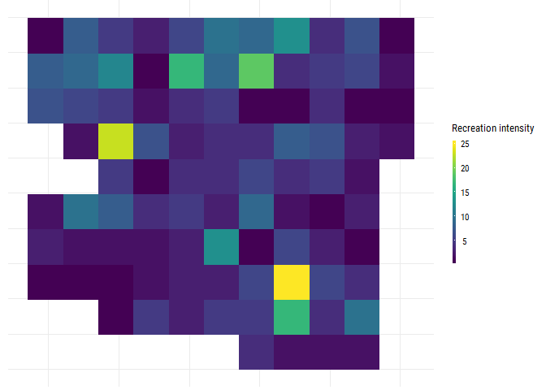
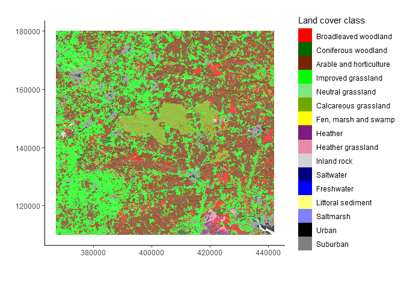
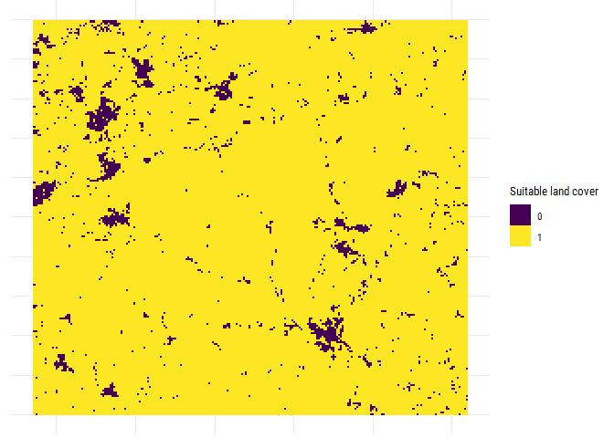
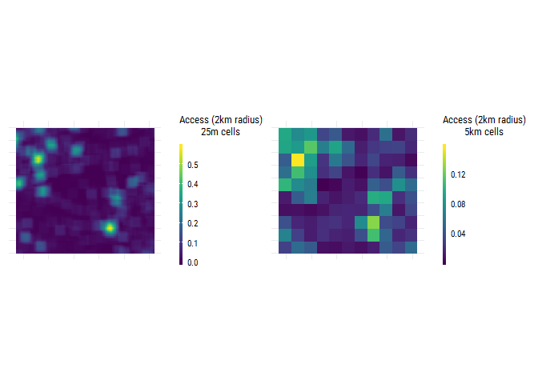
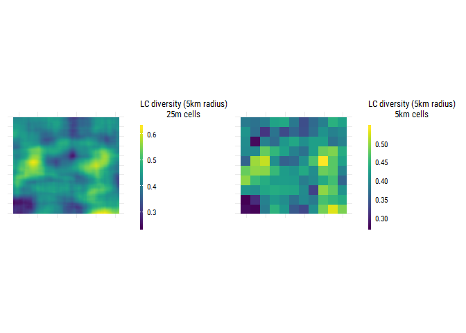
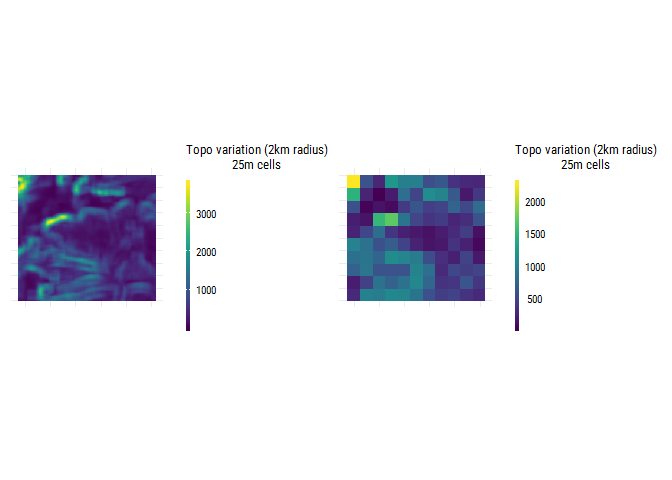
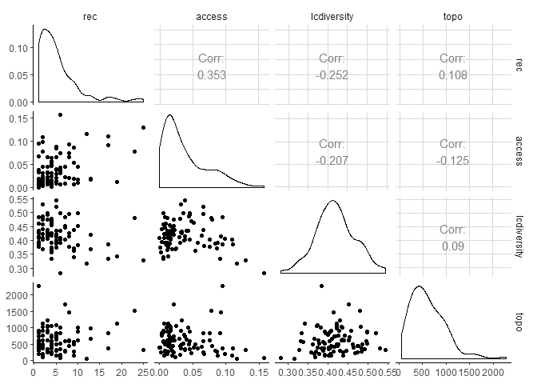
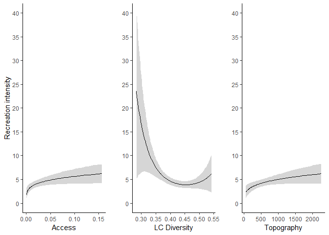

SESES: Recreation Model
================

Introduction / Aim
==================

Primary question: *How does land-use affect the provision of multiple ecosystem services?*

We will use our multiscale framework (as outlined in the upscaling paper, and built upon in this paper to extent to social-ecological systems) to understand:

1.  What level of detail (mechanism) is required to predict ES tradeoffs in the Wessex BESS landscape; and
2.  The degree to which getting the scale of the various processes right matters
3.  Whether fewer components at the right scale is as effective as (or more effective than) a more complex model at a unified scale

Our hypothesis for this paper is that by explicitly incorporating spatial structure into a system model, we can a) accurately predict spatial trade-offs in outcomes with b) relatively little information in c) a semi-mechanistic fashion.

Methods & Results
=================

Model design
------------

Developed during CEH meeting (2018-03-27) - key factors include access, suitability for recreation, quality for recreation. \[NOTE: I have moved it along from this a bit and I think that the overall design of the system model might need changing. Need to think on it. It's more about which things interact at fine scales, and which at broad scales\]

Data
----

### Recreation

We have point locations for recreation from the PPGIS study (Ridding et al. 2018), we are going to aggregate these to get intensity within 5km resolution for the study site.

### Environment

LCM 2015 (Rowland et al. 2017) data were downloaded from Edina Digimap.EU-DEM data were downloaded from [European Environment Agency](https://www.eea.europa.eu/data-and-maps/data/copernicus-land-monitoring-service-eu-dem).

Study area showing the spatial variation in environment variables (topography as hillshade, and land cover classes).

### Applying data-aggregation method to create predictor variables

We first assume that at the fine scale, a cell needs to consist of a natural, non-water land cover class to be suitable for recreation.

Each predictor variable is built up from the suitable landcover variable and any other required data in the following way:

1.  Use the moving window method to calculate the measure of interest for the variable at the appropriate scale.
2.  Multiply the resulting surface by the suitable land cover surface such that only cells which contain suitable land cover for recreation are included when aggregating to the coarse scale.
3.  Calculate the mean value at the coarse (5km) scale.

We use this method to calculate 3 predictors of recreation value for a 5km x 5km grid cell: access, land-cover diversity and topographic variation.

**Access**: amount of urban/suburban land cover and a 2km radius window.

<!---Time taken to calculate the access variable using `winmove` from `grainchanger`:--->

**Land cover diversity**: Shannon evenness of land-cover classes and a 5km radius window.

<!---Time taken to calculate the LC diversity variable using `winmove` from `grainchanger`:--->

**Topographic diversity**: variance of altitude and a 2km radius window.

<!---Time taken to calculate the LC diversity variable using `winmove` from `grainchanger`:--->

Statistical model
-----------------

Using a negative binomial GLM (due to overdispersion), we will fit a model with only main effects (Access, LC diversity, Topo variation). Due to right skew in the access and topo variation variables, we log (base 10) transform these variables. We also standardise each independent variable to have a mean = 0 and sd = 1.

| term             |    estimate|  std.error|  statistic|    p.value|
|:-----------------|-----------:|----------:|----------:|----------:|
| (Intercept)      |   1.4298299|  0.0900495|  15.878265|  0.0000000|
| access           |   0.2253443|  0.0782065|   2.881401|  0.0039591|
| lcdiversity      |  -0.2098460|  0.0704755|  -2.977573|  0.0029054|
| I(lcdiversity^2) |   0.1452849|  0.0496745|   2.924738|  0.0034475|
| topo             |   0.1781575|  0.0763731|   2.332724|  0.0196626|

All variables are significant and the model explains 26.1% of the variance in recreation intensity.

References
----------

Ridding, Lucy E., John W. Redhead, Tom H. Oliver, Reto Schmucki, James McGinlay, Anil R. Graves, Joe Morris, Richard B. Bradbury, Helen King, and James M. Bullock. 2018. “The importance of landscape characteristics for the delivery of cultural ecosystem services.” *Journal of Environmental Management* 206 (2018). Elsevier Ltd: 1145–54. doi:[10.1016/j.jenvman.2017.11.066](https://doi.org/10.1016/j.jenvman.2017.11.066).

Rowland, C S, R D Morton, L Carrasco, G McShane, A W O’Neil, and Wood C M. 2017. “Land Cover Map 2015 (vector, GB).” NERC Environmental Information Data Centre. doi:[10.5285/6c6c9203-7333-4d96-88ab-78925e7a4e73](https://doi.org/10.5285/6c6c9203-7333-4d96-88ab-78925e7a4e73).
